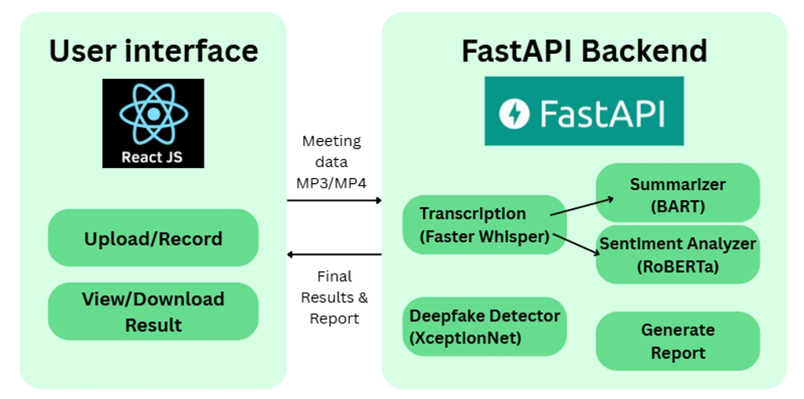

<h1 align="center">AI-Driven Meeting Analysis</h1>
<p align="center">
  Transcript → Summary → Sentiment → Deepfake
</p>

<p align="center">
  
  
  
  
  
</p>

<p align="center">
  
</p>

## Overview
A lightweight web app that turns recorded meetings into actionable outputs:
- **Transcript** (Faster-Whisper)
- **Summary** (BART-SAMSum)
- **Sentiment** per segment (RoBERTa)
- **Deepfake** frame scoring (XceptionNet)
- **Consolidated PDF** export

**Frontend:** React · **Backend:** FastAPI · **Runtime:** CPU-only friendly

## Features
- Single-shot processing after upload/record (no streaming)
- Token-aware chunking (~900 tokens) + optional second-pass summary
- Per-segment sentiment labels + aggregate pie chart
- Deepfake scoring for MP4 (≈30s/frame) + frames ZIP export
- Inline status/error banners; no blocking pop-ups

## Architecture
<p align="center">
  
</p>


## Quick Start

### Prerequisites
- Python 3.10 (FFmpeg available in PATH)
- Node 18+ / npm
- (Windows) Verified with Intel i5-11400, Chrome

### One-click (Windows)
In repo root, double-click: `start_fyp.bat`

### Manual
**Backend**
```bash
cd backend
python -m venv venv
.\venv\Scripts\activate
pip install -r requirements.txt
uvicorn main:app --reload
